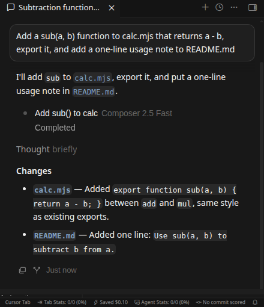
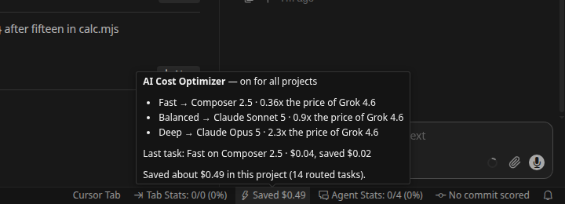
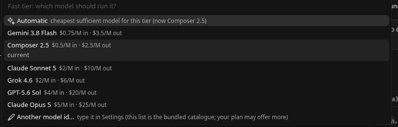
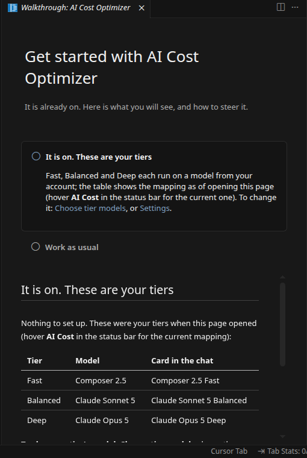

# AI Cost Optimizer for Cursor

Routes each Cursor request to the **cheapest sufficient model tier** — `fast`, `balanced` or `deep` — by
delegating to tier subagents that run on cheaper models, with hooks that enforce risk guardrails, learn from
outcomes and log every decision. This extension sets up the
[AI Cost Optimizer plugin](https://github.com/khalidsaidi/cursor-ai-cost-optimizer) inside your project without
the Cursor plugin marketplace, and ships a self-contained hook binary for machines without Node.js.

## What you see

| A routed task: the card names the model, the status bar keeps the receipt | The status tooltip: tiers next to your chat model, the last task, the total |
|---|---|
|  |  |

| Choose tier models: one row per model, with prices | Get Started: your real tiers, nothing to set up |
|---|---|
|  |  |

## Getting started

1. **Install it.** It turns itself on, quietly: the status bar item switches to `⚡ AI Cost` and a Get Started page shows your three tiers with a **Choose tier models** link; no popup, no question, no reload, nothing written into any project: the Cost Optimizer registers in Cursor's own user-level config (`~/.cursor/hooks.json` entries, `~/.cursor/agents/<model>-<tier>.md`) and keeps its state in the extension's storage, the way Copilot keeps its state in the editor. **Remove** in the status menu takes it all back out.
   - Prefer repo files? `AI Cost Optimizer: Turn On / Update Models` also offers **This project only**: 8 files under the project's `.cursor/`, shown to you before anything is written.
2. **Work normally.** Keep your usual chat model. A routed task shows a subagent card named after its model and tier (**Composer 2.5 Fast**); click the card to see the subagent's steps and diffs, and use Cursor's usual **Review** bar for the changes. Risky work goes to the strong tier and says so. The status bar shows what you have saved in the project (an estimate from list prices, net of each subagent's session start; Cursor does not expose billed usage to extensions); its tooltip shows the tiers, the last task and the total.
3. **Steer when you want to.** **Choose tier models** in the status menu picks which model runs Fast, Balanced and Deep. `[cco:fast]`, `[cco:balanced]`, `[cco:deep]` in a prompt force a tier for one request; `[cco:off]` bypasses routing once. **Pause here** switches a project off without removing anything.

## Features

- **Tiered routing with real savings**: the routing rule scores each request (complexity, risk, breadth,
  uncertainty, latency) and delegates to `fast-tier` / `balanced-tier` / `deep-tier` subagents, each pinned to a
  model your account can run. Delegation only happens when a typical task costs at least 20% less delegated than done in the chat, with the delegation's whole cost counted: the subagent's own session plus the chat's dispatch and relay. That cost model is calibrated on Cursor's own bill (usage events, 2026-09-05, one task: a module, its tests and a README section, tests passing in every run). A Composer subagent bills about 4¢ for that task and the chat about 3¢ to dispatch and relay it, while doing the work directly bills 6 to 14¢ on Auto (Cursor bills Auto at one fixed rate, $2 per million input tokens, $0.50 cache read, $6 output) and 10¢ on Grok 4.6 High. So on **Auto, Composer, Grok, Sonnet and GPT** routine work stays in the chat, and what gets routed is risky or complex work, to the Deep tier, for quality. A Fast delegation pays for itself from Opus-class chat models by the same profile (an estimate: Opus could not be billed on the test account, where Cursor silently ran Grok High Fast for a chat whose picker said Opus). In the Cursor CLI an Auto chat's subagents are billed as Auto too (13.7¢ direct, 24.9¢ with a forced Fast subagent), so a CLI Auto chat never delegates on its own.
- **The Cursor CLI routes too**: `cursor-agent` sessions run the same hooks, and an agents-only local plugin (`~/.cursor/plugins/local/cco-agents`, generated, no hooks or commands) lets the CLI's Task tool see the tier subagents. A headless CLI run of the same task billed $0.24 on Grok directly against about $0.11 routed, but headless runs reject shell commands and Grok retried many times; in the IDE the same task on Grok billed $0.10 direct, so the CLI figure describes that run, not a rule.
- **A chat of its own**: the `AI Cost Chat` view in the activity bar (or **Open cost-routed chat** from the status bar menu) is a chat panel the extension owns, so every reply is shown under the name of the model that produced it. Each request is routed by the same scorer as the hooks (or forced to a tier from the picker) and runs on that tier's model through the Cursor CLI on your own account: no API keys, same bill, and the cheap model does the work directly, with no chat paying to dispatch and relay it. What it does that a chat must: the reply streams; the active file and selection go with the request (a chip above the input shows what, and switches it off); every tool call is listed, edits with their diff (Roo Code's diff view) and commands with their output (Cline's code block); each turn shows its cost from the token usage the CLI reports and the same tokens at Auto's billed rate; a checkpoint of the workspace is taken before each turn (Roo Code's shadow-git checkpoints) so **Restore files to before this turn** undoes it in one click; a reload keeps the conversation and **History** reopens earlier ones; a model that hits its usage limit on your plan is swapped for the next tier with one line saying so, and is not tried again for six hours; the model stays the same across a conversation unless a request needs a stronger tier; Esc stops a running turn. Needs `cursor-agent` installed and logged in, and `git` for checkpoints. Vendored code and licenses: THIRD_PARTY_NOTICES.md.
- **You can see what ran**: the chat's own picker keeps showing the chat model whatever the extension did, so the status bar names where the last task ran (`⚡ Composer 2.5 · Fast` or `⚡ In chat · Auto`), a delegated task raises a short notification naming its model, the subagent card is named after the model (`Composer 2.5 Fast`), and the subagent's own message starts with `Done by Composer 2.5 (Fast tier).` (open the card to read it: the chat model tends to paraphrase it).
- **Tiny changes stay in the chat**: a one-line addition to one file costs more delegated than done in place (the subagent's own session start), so it is not delegated; measured: $0.070 routed against $0.064 direct.
- **Effort matched to the tier**: reasoning effort is paid in output tokens, and Cursor's Auto never turns it down. The Balanced tier runs its model at medium effort (`claude-sonnet-5-medium` when the account lists it), Deep at high; the estimates price effort (high ≈ 1.5x the output of medium, thinking variants more), and the tooltip shows it: `Balanced → Claude Sonnet 5 (medium effort)`.
- **Hooks that enforce it**: the Task guard rewrites mis-routed delegations and applies guardrails (high risk
  never runs FAST); the tool gate keeps expensive chat models from doing cheap work themselves; outcome learning
  escalates tiers that keep failing; every decision is logged to `.cursor/cco/state/decisions.jsonl`.
- **Zero-dependency hooks**: platform builds bundle a `cco-hook` binary, so hooks run without Node.js.
- **Status bar** `AI Cost` with each tier's model and rate multiplier, the estimated savings in this project,
  and a warning icon when the price table is older than 7 days or a tier is still `inherit` (run `/cco-init`).
- **Recommend Tier** scores selected text with the same heuristics the hooks use.

## Commands

| Command | What it does |
| --- | --- |
| AI Cost Optimizer: Turn On / Update Models | Turns the Cost Optimizer on for all projects (seconds, nothing written into projects) or for the open folder only (shows the 8 files first); re-maps the tiers when already on. |
| AI Cost Optimizer: Choose Tier Models | Picks which model runs Fast, Balanced and Deep from the models this account can use; applies to all projects (or this project). |
| AI Cost Optimizer: Remove | Removes everything the setup wrote (everywhere, or from the open folder); other tools' hook entries and your own files are kept. |
| AI Cost Optimizer: Pause / Resume Here | Switches routing off or on for the open folder without removing anything; paused chats work as before. |
| AI Cost Optimizer: Savings and Tier Rates | What you have saved in this project, each tier's model and its price next to your chat model, and, for selected text, the recommended tier. |
| AI Cost Optimizer: Insert [cco:fast] / [cco:balanced] / [cco:deep] | Inserts an override token at the cursor (editor commands). |
| AI Cost Optimizer: Open Status Menu | The same menu as clicking **AI Cost** in the status bar. |
| AI Cost Optimizer: Show Log | Opens the "AI Cost Optimizer" log output. |
| AI Cost Optimizer: Copy Diagnostics | Copies a bug-report summary (runtime mapping, hook mode, binary hash, Node and Cursor versions) to the clipboard. |

## Settings

Everything a user is expected to touch is in Cursor's Settings UI under **AI Cost Optimizer** (search "cost optimizer"). User settings apply to every project; the same keys set at workspace level apply to that project only (and only then does a `.cursor/cco.json` appear there). Changes take effect on the next hook call; tier model changes re-map the tiers at once.

| Setting | Default | What it does |
| --- | --- | --- |
| `costOptimizer.autoEnable` | on | Turn the optimizer on automatically after install (once per machine; Remove from Cursor turns it off). |
| `costOptimizer.tierModels.fast` / `.balanced` / `.deep` | empty (automatic) | Model id that runs each tier, e.g. `composer-2.5`, `claude-sonnet-5-thinking-high`. **Choose tier models** in the status menu writes these from the list of models your account can use. |
| `costOptimizer.enforceRouting` | off | Enforce cost routing instead of advising it: a chat model materially pricier than the tier's model may not edit or run commands itself. |
| `costOptimizer.alwaysDelegate` | off | Route every request that needs tools through a tier subagent, even when it is not cheaper (keeps costs logged per tier). |
| `costOptimizer.chatBudgetUsd` | 0 (off) | Estimated spend per chat after which you are warned (80%) and routing is forced to Fast beyond twice the budget. |
| `costOptimizer.modelCooldownHours` | 6 | How long a model that refused to start (usage limit) is skipped; tasks step down a tier meanwhile. |
| `costOptimizer.showSavingsInStatusBar` | on | `⚡ Saved ~$4.12` in the status bar, or just `AI Cost`. |
| `costOptimizer.showRoutingNotifications` | on | A short notification naming the model doing a delegated task (`Composer 2.5 (Fast tier) is doing this task`); the chat's picker keeps showing the chat model. |
| `costOptimizer.chat.runCommands` | auto-review | Which commands the cost-routed chat may run: safe ones (tests, builds) under the CLI's auto-review, everything (`force`), or none. |
| `costOptimizer.chat.cliPath` | empty | Full path to `cursor-agent` when it is not on the PATH the extension host sees; otherwise PATH, `~/.local/bin` and the installer's versions directory are tried. |
| `costOptimizer.chat.includeActiveFile` | on | Send the active file and selection with each request (the chip above the input shows what goes; untick it per request). |
| `costOptimizer.chat.checkpoints` | on | Take a checkpoint of the workspace before each turn so its edits can be restored in one click (a shadow git repository under the extension's storage; needs `git`). |
| `costOptimizer.hookRuntime` | auto | Node.js when available, else the bundled binary. |
| `costOptimizer.nodePath` | empty | Node.js executable for the setup scripts. |

Advanced routing knobs (scoring weights, thresholds, per-tier tool budgets) stay in the plugin's `cco.json` (`plugins/cursor-ai-cost-optimizer/config/defaults.json` documents them) and are not needed day to day.

## Requirements

- Cursor 3.13 or newer (project hooks, subagents).
- Optional: the Cursor CLI (`cursor-agent`) logged in. With it, setup maps the tiers from your account's real model list and verifies each one; without it, the tiers come from the bundled catalogue (FAST composer-2.5, BALANCED Sonnet, DEEP Opus) and Cursor applies your plan's access rules when a subagent runs.
- **Node.js >= 18 on the PATH Cursor sees.** The hook entries in `.cursor/hooks.json` run `node .cursor/cco-hook.mjs`,
  so the file stays portable for every teammate who clones the repo. On a machine without Node, the bundled
  `cco-hook` binary is used instead (`costOptimizer.hookRuntime`), which makes the hook entries point at a machine-local path.
- A trusted, local workspace (the extension writes `.cursor/` files and installs hooks that execute code).

## Platform support

One VSIX is published per target, each carrying the hook binary compiled for that platform:

| Target | Runner that builds, tests and installs it in CI |
| --- | --- |
| Linux x64 | `ubuntu-latest` |
| Linux ARM64 | `ubuntu-24.04-arm` |
| Windows x64 | `windows-latest` |
| Windows ARM64 | `windows-11-arm` |
| macOS Intel | `macos-15-intel` |
| macOS Apple Silicon | `macos-latest` |

On every target, CI compiles the binary natively, runs the unit suite (including the compiled-binary tests), pipes
real hook payloads through the binary, runs the VS Code integration suite, packages the VSIX with `--target`, then
installs that VSIX into a downloaded VS Code with `--install-extension`, lists it back with its version and
uninstalls it (`npm run verify:vsix`). A release publishes all six under the same version.

## What it does to your Cursor

Measured against the bar set by the big first-party extensions (Copilot Chat, Amazon Q, Gemini Code Assist):

| | Everywhere (default) | This project only |
| --- | --- | --- |
| On install | Turns itself on (once per machine): hook entries and subagents in `~/.cursor`, state in the extension's storage. No popup, no files in any project. | Registers the commands and the status bar item; nothing until you choose it. |
| On setup (you confirm first) | CCO entries merged into `~/.cursor/hooks.json`, five subagents in `~/.cursor/agents/`, state in the extension's storage. **No project files.** | 8 files under the project's `.cursor/` plus a git-ignored state folder; they show up in git status. |
| While you chat | Chat start answers from cache in about 0.1 s (price and model refreshes run in a detached worker, never on the chat path). One hook process per delegation, edit or shell command (reads are not hooked): about 0.05 s on Linux and macOS, about 0.65 s on Windows where Cursor spawns hooks through a shell (44 ms measured with Node, 37 ms with the binary); a hung hook is killed after 5 s and the call proceeds (measured in Cursor: a failed or hung hook never blocks the chat, it costs at most its timeout). One footer line per routed task. Nothing blocked by default. | same |
| Projects you paused / did not set up | Paused projects: the chat is told to work normally and any `cco-*` delegation is turned back into in-chat work (the rule and subagents are user-level and cannot be unloaded per project). | Untouched: no files, no messages, no hooks. |
| On extension update | Hook entries are repointed silently. | The pinned plugin path and binary are refreshed silently. |
| On every activation | 1.5 s after startup, off the extension host thread: a repair pass, then a self-check that runs the real hook command once. If it fails or does not answer in 6 s, the hooks are turned off and you get one message. | same |
| A remote window (WSL, SSH, container) right after install or **Choose tier models** | Cursor lists subagents when a window opens and does not refresh the list in remote windows. After a first setup the status bar reads **AI Cost: reload to finish** and work stays in the chat until that one reload; after a re-map the window keeps its previous mapping until it is reloaded. Nothing fails in between. |
| You used the Cursor plugin before | A local copy under `~/.cursor/plugins/local` is retired automatically (moved under the extension's storage). A marketplace copy has to be uninstalled in Cursor Settings → Plugins; the status menu says so until it is gone. |
| The chat model keeps editing instead of delegating | Routing is advice plus a short hold: risky work and your explicit `[cco:…]` requests are refused twice with the reason, then the chat model is let through so you are never stuck, and the line reads "Working in chat on <model>". Enforce mode (`costOptimizer.enforceRouting`) refuses every time. |
| You disable the extension in the Extensions view | Cursor gives extensions no signal on disable, so the hooks keep routing (they live in Cursor's own config). Use **Remove from Cursor** or **Emergency stop** in the status menu first; uninstalling the extension does clean up. |
| If you want it off right now | Status menu → **Emergency stop**: hook entries removed, nothing else touched; Update models restores. | same |
| On Remove | Hook entries, subagents and state removed. Other tools' entries kept. Nothing left. | Everything under `.cursor/` that CCO wrote is removed; other tools' hook entries and your files are kept. |
| If you uninstall the extension | Its uninstall hook removes the hook entries, the subagents and its storage. Nothing left. | Project files stay until you run Remove; the shim retires its own hook entries after 7 days. |

## Engineering conventions

The same conventions the first-party extensions (Copilot Chat, Amazon Q, Gemini Code Assist) follow inside the editor:

- Activation on `onStartupFinished`; all work deferred 1.5 s and fully async. No synchronous child process ever runs on the extension host.
- Every command is wrapped; errors go to the **AI Cost Optimizer** log channel and surface as one message with **View Logs**.
- Long operations run under a cancellable progress notification; cancelling kills the child process.
- Commands declare `enablement` on context keys (`cco.mode`, `cco.paused`), so the palette only offers what applies.
- Setting changes (`costOptimizer.hookRuntime`, `costOptimizer.nodePath`) take effect immediately through a repair pass.
- Self-check on activation turns the hooks off if the real hook command fails; kill switch in the status menu.
- Strict TypeScript plus type-aware ESLint (unhandled promises are errors) gate CI; user-facing strings go through `vscode.l10n` with an exported bundle.
- Workspace trust and virtual workspaces are declared; state lives in the extension's storage, never in your repo (Everywhere) or only under `.cursor/` (project scope).
- Unit tests (including the compiled binary and the user scope), a VS Code integration suite, and a real install of each packaged VSIX on six native CI runners.

## What is written to your workspace

Only files under `<workspace>/.cursor/`; nothing elsewhere in the repo and nothing in your home directory:

- `.cursor/hooks.json` — CCO entries merged in (`"<abs path>/.cursor/cco/bin/cco-hook" <event>` or
  `node .cursor/cco-hook.mjs <event>`); entries from other tools are preserved.
- `.cursor/agents/cco-{fast,balanced,deep,verifier}.md` — tier subagents with a concrete `model:`; generated
  files carry a marker and are never overwritten if you edit them.
- `.cursor/rules/cco-routing.mdc` — the routing rule. (Skills and chat commands are not copied; the extension's own commands cover them.)
- `.cursor/cco.json` — project settings (optional; created when you change a setting). `.cursor/cco-hook.mjs` — hook shim, committed next to hooks.json. `.cursor/cco/` — `plugin-path.txt`, `runtime.json`,
  `pricing.json`, `bin/cco-hook` (binary mode), `extension-manifest.json`, and `state/` (logs, sessions).
  Add `.cursor/cco/` to `.gitignore` if you do not want logs in git — the extension never edits `.gitignore`.

See **Uninstall** below before removing the extension.

## Network access and data

The extension itself has no telemetry and opens no connections. Two network activities happen during
**Turn On / Update Models** and later hook runs, both performed by the bundled plugin scripts:

1. **Pricing**: `https://cursor.com/docs/models-and-pricing.md` is fetched (setup, and again by the
   `workspaceOpen`/`sessionStart` hooks when the cache is older than `pricing.refreshHours`, default 24 h). A
   bundled snapshot is used when the fetch fails.
2. **Model discovery**: `cursor-agent models` and `cursor-agent --version` are run (setup, and by the hooks when
   the mapping is older than `discovery.refreshHours`). Running `/cco-init` additionally sends short **probe
   requests** through the Cursor CLI to confirm each candidate model actually runs on your account — those
   count against your Cursor usage like any other request.

What is stored locally, all under `<workspace>/.cursor/cco/`: `runtime.json` (available model ids and the
tier mapping), `pricing.json` (the price table), and `state/` with `decisions.jsonl` (per delegation: tier,
requested/final subagent, model id, effort scores, guardrail, cost estimates), `hooks.jsonl` (hook event names,
tool names, allow/deny reasons), `sessions/` (conversation ids, chat model id, counters) and `last-prompt.json`
(scores only). **Prompt text is never stored.** Delete `.cursor/cco/state/` at any time, or run **Uninstall from
This Workspace** to remove everything; add `.cursor/cco/` to `.gitignore` to keep logs out of git.

## Uninstall

1. Run **AI Cost Optimizer: Remove from This Workspace** in every project where you installed it. It removes
   the CCO entries from `.cursor/hooks.json` (other entries stay), `.cursor/agents/cco-{fast,balanced,deep,verifier}.md`
   (only files carrying the generated marker), `.cursor/cco.json`, `.cursor/cco/` (shim, binary, runtime,
   pricing, state) and `.cursor/rules/cco-routing.mdc`.
2. Then uninstall the extension. Removing the extension **alone** leaves those files in place: the hook entries
   keep pointing at `.cursor/cco/bin/cco-hook` (still present, so hooks keep working) or, in node mode, at the
   shim whose `plugin-path.txt` points at the deleted extension folder — Cursor then reports failing hooks and the
   doctor cannot run because the extension is gone. The `vscode:uninstall` hook only removes the extension's own
   global storage. Without the extension you can still clean a project with the plugin:
   `node <plugin>/scripts/cco-init.mjs --workspace . --uninstall` (`<plugin>` from `.cursor/cco/plugin-path.txt`).

## License

MIT — see LICENSE. Contributing, building and the proof harness are documented in CONTRIBUTING.md.
