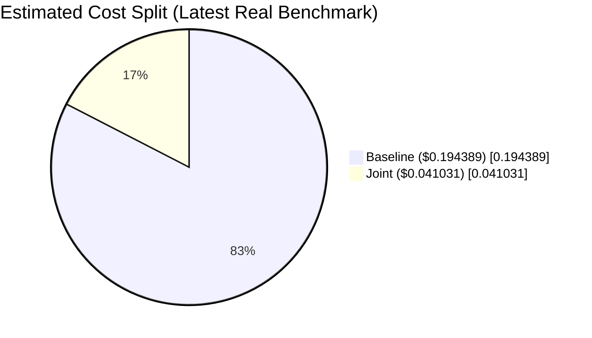

# AI Cost Optimizer (Cursor Plugin)

Spend less on Cursor usage without forcing your team into manual model micromanagement.

AI Cost Optimizer auto-selects the cheapest sufficient model+tier for each request, then enforces safety guardrails for high-risk work.

What you get:
- Lower spend on routine and medium-risk tasks
- Faster average response times
- Safety-first behavior for critical-risk requests

- **FAST**: short answers, minimal tool use
- **BALANCED**: normal workflow
- **DEEP**: thorough + verification for risky/complex tasks

## Proven in real Cursor runs
Latest benchmark (February 21, 2026) with real `cursor-agent` calls, isolated chaos workspace, 24 paired runs:

- **78.89% lower estimated cost** (`$0.194389` -> `$0.041031`)
- **~62% lower average API latency** (`14379.7ms` -> `5466.8ms`)
- **Quality pass rate preserved** (`75.00%` baseline vs `75.00%` joint)
- **Quality not worse in 95.83% of paired cases**




Reproduce it:

```bash
node plugins/cursor-ai-cost-optimizer/scripts/cco-joint-chaos-real.mjs --workspace . --repeats 2
```

Report files:
- `.ai/cco/joint-chaos-real-report.md`
- `.ai/cco/joint-chaos-real-report.json`

Quick comparison table:

| Metric | Baseline | Joint | Improvement |
|---|---:|---:|---:|
| Estimated cost | $0.194389 | $0.041031 | **-78.89%** |
| Avg `duration_api_ms` | 14379.7 | 5466.8 | **-61.98%** |
| Quality pass rate | 75.00% | 75.00% | **Preserved** |
| Paired quality-not-worse | - | 95.83% | **Strong stability** |

## How to use
- Default behavior: routing happens automatically via the `cco-routing` rule.
- Manual overrides: add one token anywhere in your prompt:
  - `[cco:fast]`, `[cco:balanced]`, `[cco:deep]`, `[cco:auto]`

## Components
- Rule: `rules/cco-routing.mdc`
- Skills: `skills/cco-init/SKILL.md`, `skills/cco-model-config/SKILL.md`, `skills/cco-report/SKILL.md`
- Agents: `agents/cco-router.md`, `agents/cco-fast.md`, `agents/cco-balanced.md`, `agents/cco-deep.md`, `agents/cco-verifier.md`
- Commands: `commands/cco.md`, `commands/cco-models.md`, `commands/cco-benchmark.md`
- Hooks: `hooks/hooks.json`

## Setup (recommended)
Run the skill **cco-init** in a workspace to create:
- `.cursor/cco.json` (tuning)
- `.cursor/cco-runtime.json` (real Cursor model mapping discovered at runtime)
- `.cursor/cco-pricing.json` (official pricing cache refreshed on session start)
- `.ai/cco/` (telemetry)

## Friendly model setup
Use `/cco-models` in Cursor:
1) Adaptive (recommended for most users)
2) Fixed models
3) Manual (advanced)

It updates `.cursor/cco.json`, reruns discovery, and shows final mapping.

What these mean:
- Adaptive: best default for marketplace users; no manual model picking.
- Fixed models: keep the current working model choices fixed until changed.
- Manual: pick exact model IDs per mode (`fast`, `balanced`, `deep`).

Advanced users can edit `.cursor/cco.json` directly:
```json
{
  "modelOverrides": {
    "fast": "",
    "balanced": "",
    "deep": ""
  },
  "modelOverridePolicy": "best_effort"
}
```

## Real behavior test
Run the real Cursor E2E test (discovery + router checks):
```bash
node plugins/cursor-ai-cost-optimizer/scripts/cco-e2e-real.mjs --workspace .
```
This writes:
- `.ai/cco/e2e-real-report.md`
- `.ai/cco/e2e-real-report.json`

## Notes on model selection
FAST/BALANCED/DEEP are CCO routing labels, not native Cursor model tiers.
`cco-init` runs `scripts/cco-discover-models.mjs` to detect models available to the current user/session and map each tier to a real model ID in `.cursor/cco-runtime.json`.
If a preferred model is unavailable, routing falls back to `auto` while preserving effort budgets.
When account limits reduce runnable options, `.cursor/cco-runtime.json` marks `health.degraded: true` and tiers may share the same runnable model.

## Pricing refresh
- Hook: `hooks/hooks.json` -> `sessionStart` runs `scripts/cco-session-start.mjs`
- Source: `https://cursor.com/docs/account/pricing`
- Cache file: `.cursor/cco-pricing.json`
- Default policy: refresh at most once every 24 hours (configurable in `.cursor/cco.json` under `pricing.refreshHours`)
- Routing can use `costHeuristics` from `.cursor/cco.json` for boundary tie-breaks (field weights + tier multipliers).

## Joint scorer (simple)
CCO can evaluate model + tier together using one loss:

`TotalLoss = wc*C_hat + wq*R_hat + wl*L_hat`

- `C_hat`: cost estimate (pricing prior + runtime field proxy)
- `R_hat`: risk/quality estimate (fuzzy task signals + historical failures/rework)
- `L_hat`: latency estimate

For high-risk tasks, CCO applies a strict safety threshold on `R_hat` before cost optimization.
For critical risk (`risk >= 9`), CCO forces DEEP unless the user explicitly overrides.

### Real benchmark
Run the isolated chaos benchmark (real Cursor calls, no mocked model execution):

```bash
node plugins/cursor-ai-cost-optimizer/scripts/cco-joint-chaos-real.mjs --workspace . --repeats 2
```

Outputs:
- `.ai/cco/joint-chaos-real-report.json`
- `.ai/cco/joint-chaos-real-report.md`

Note:
- Cost is estimated from official Cursor pricing rates plus runtime field proxies, because per-run billed cost is not exposed in CLI output.
