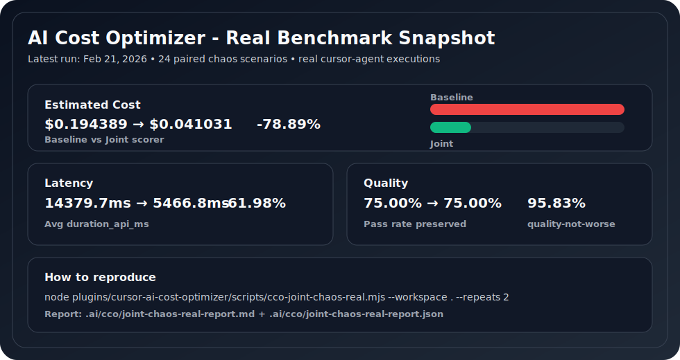
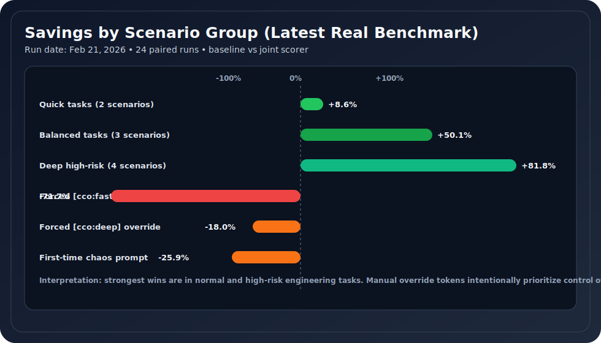
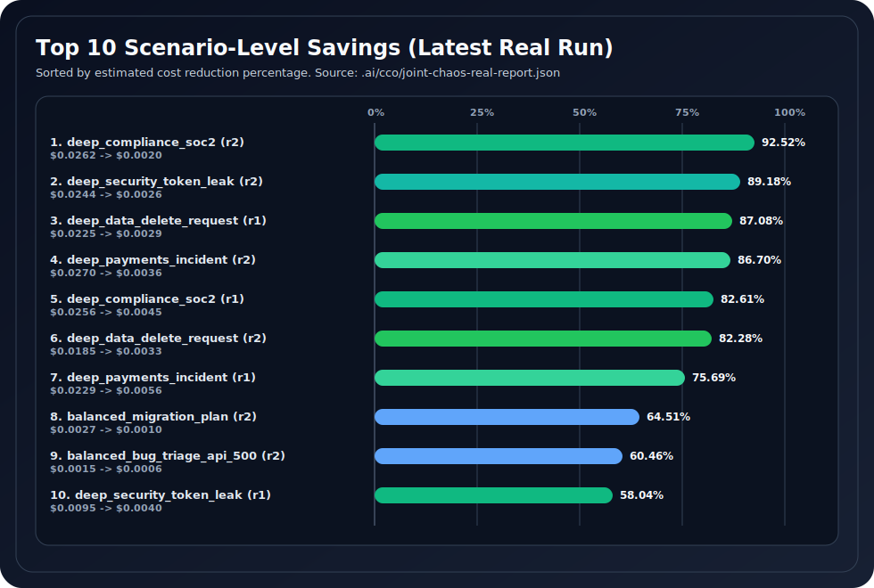

# /cco — AI Cost Optimizer Help

## Why people use this
- Real benchmark result (February 21, 2026, 24 paired chaos runs):
  - `78.89%` lower estimated cost
  - `75.00%` quality pass rate preserved vs baseline
  - `95.83%` paired quality-not-worse

## 30-second setup
1) Run `cco-init` once.
2) Run `/cco-models`.
3) Pick one option:
- **Adaptive (recommended for most users)**: CCO chooses models automatically as availability changes.
- **Fixed models**: save the current working model per mode and do not auto-change it.
- **Manual (advanced)**: choose exact model IDs yourself.
4) Keep pricing refresh on (default): CCO refreshes `.cursor/cco-pricing.json` on `sessionStart` at most once every 24h.
5) Run `/cco-benchmark` for a real baseline-vs-joint benchmark report.

Done. Use CCO normally after that.

Most users should keep **Adaptive**.

## Optional prompt overrides
- `[cco:fast]`
- `[cco:balanced]`
- `[cco:deep]`
- `[cco:auto]`
